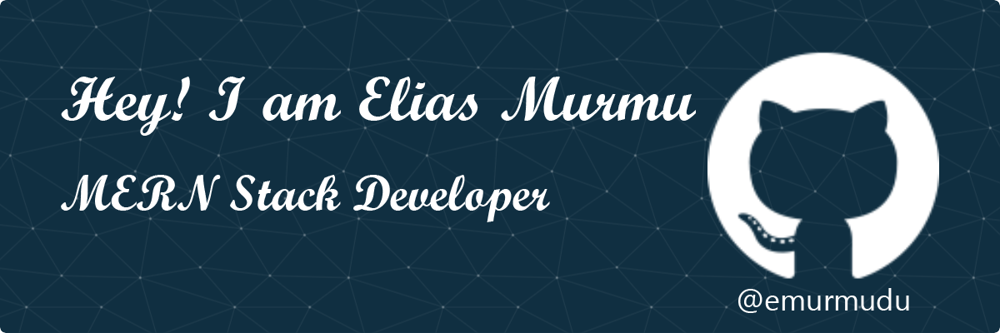

# Overview

<!--
## 🙋‍♂️ About Me:

-->
## 🌐 Socials:
 

## 💻 Tech Stack:
            

   

     

      

     

## 📊 Current Stats
<!--START_SECTION:activity-->

<!--END_SECTION:activity-->

<!--START_SECTION:activity-->
 
<!---->
<!--END_SECTION:activity-->

<!--START_SECTION:activity-->

<!---->

<!--END_SECTION:activity-->

<!--## 🔝 Top Repos-->
<!--START_SECTION:activity-->
<!---->
<!--END_SECTION:activity-->

## 💫 Ongoing Activities
- 🔭 I’m currently working on individual project. 
- 🌱 I’m currently learning Typescript, Redux, Express, mongodb mongoose and next js.
- 👯 I’m looking to collaborate on new projects.

<!--START_SECTION:activity-->
<!--
  
-->
<!--END_SECTION:activity-->
